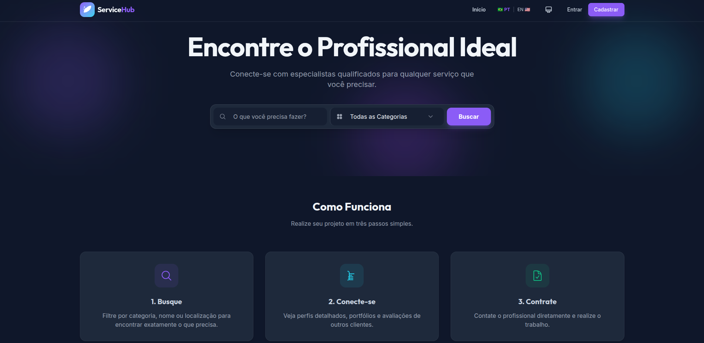

# 🛠️ Catálogo de Serviços (WorkLink)

**Trabalho Prático - Disciplina Web 1 (CSI606-2025-01)**  
_Discente: Pedro Henrique da Cruz Santos (21.1.8148)_

---

## 📖 Sobre o Projeto

O **Catálogo de Serviços** (também referenciado conceitualmente como *WorkLink*) é uma plataforma web *two-sided marketplace* projetada para conectar **Clientes (Contratantes)** a **Profissionais Autônomos (Trabalhadores)** locais. 

A aplicação visa solucionar o problema de visibilidade de profissionais independentes, permitindo que construam uma vitrine digital de seus trabalhos (Portfólio) e construam reputação através de avaliações. Paralelamente, oferece aos clientes uma ferramenta de busca eficiente para encontrar mão de obra qualificada na sua região e solicitar serviços de forma ágil e centralizada.



---

## Arquitetura e Stack Tecnológico

O projeto foi construído seguindo uma arquitetura robusta **Full-Stack**, separando claramente as responsabilidades entre a API (Backend) e a Interface de Usuário (Frontend).

### Frontend (Client-Side)
Desenvolvido como uma **Single Page Application (SPA)** de alta performance estruturada em componentes independentes.

* **Framework:** Angular 17+ (Standalone Components).
* **Estilização:** Tailwind CSS (garantindo responsividade e Design System customizado com suporte a Dark Mode abstrato).
* **Internacionalização (i18n):** Integração com `ngx-translate` para suporte a múltiplos idiomas (Inglês e Português).
* **Comunicação:** `HttpClient` do Angular com Observables (RxJS) lidando com requisições assíncronas de forma reativa.
* **UX/UI:** Componentes interativos, Modais de requisição dinâmicos, Notificações (Toasts) amigáveis e feedback de "*Loading States*" durante resoluções de rede.

### Backend (Server-Side)
Uma API RESTful performática que processa todas as regras de negócio e validações de segurança da plataforma.

* **Ambiente:** Node.js com Express.js.
* **Linguagem:** TypeScript (Garantindo tipagem estática e segurança do código).
* **Banco de Dados:** SQLite (leve e portátil, ideal para o escopo do trabalho prático).
* **ORM (Database Access):** Prisma ORM responsável pela modelagem do schema relacional, migrações e comunicação type-safe com o banco de dados.
* **Segurança e Autenticação:** 
  * Senhas hasheadas e salteadas utilizando a biblioteca `bcrypt`.
  * Middleware de autenticação baseado em `JSON Web Tokens (JWT)`.
  * Proteção e autorização de rotas com base no `Role` do usuário logado (Contratante vs Trabalhador).

---

## Funcionalidades Principais

### Autenticação e Gestão de Perfis
- Registro e Login diferenciado entre Perfil **CONTRATANTE** e **TRABALHADOR**.
- O Trabalhador gerencia suas informações como Nome, Profissão, Biografia Explicativa e Localização da área de atuação.

### Painel do Trabalhador (Worker Dashboard)
- **Gestão de Portfólio:** O profissional pode fazer upload e curadoria visual de artes, instalações, ou serviços anteriores prestando contas de seu talento num grid dinâmico.
- **Caixa de Entrada (Job Requests):** Tela dedicada para monitoramento de propostas de serviços recebidas por clientes, podendo gerenciar o ciclo de vida alterando o status para `ACEITO` ou `RECUSADO`.

### Experiência do Contratante (Client Experience)
- **Busca Avançada:** Filtros interativos para localizar profissionais por nome da ocupação ou categorias de atuação (ex: Elétrica, Hidráulica, Design).
- **Home Dinâmica:** View Customizada - a homepage exibe CTAs motivacionais para usuários convidados, mas otimiza a tela apenas com os catálogos para usuários já integrados.
- **Workflow de Contratação ("Hire Now"):** Um Contratante pode visitar o perfil público do profissional, validar sua reputação (Rating/Reviews) e abrir um Modal de Contratação detalhando o serviço a ser feito.

### Sistema de Reputação
- Após as contratações, os usuários alimentam o sistema de avaliações, onde notas (1 a 5 estrelas) e análises escritas são adicionadas permanentemente ao perfil de quem executou a atividade, gerando um Ranking natural exposto na Homepage da plataforma.

---

## Como Clonar e Rodar Localmente

Certifique-se de ter o [Node.js](https://nodejs.org/) (versão 18+) instalado na sua máquina.

### 1. Preparando o Backend
Abra um terminal e acesse a pasta `backend`:
```bash
cd backend
npm install
```

Configure o Banco de Dados gerando os artefatos do Prisma, inserindo as sementes (Seed) de teste predefinidas:
```bash
npx prisma generate
npx prisma migrate dev
npx prisma db seed
```
> *Nota:* O Seed populou o banco com categorias realistas, o perfil "João Eletricista" (`joao@email.com` | senha: `password`), clientes de teste e propostas (Requests) para você já visualizar coisas na tela!

Por fim, inicie o servidor da API:
```bash
npm start
```
*A API estará rodando por padrão em `http://localhost:3000`*.

### 2. Preparando o Frontend
Em um **novo terminal**, navegue até a pasta `frontend`:
```bash
cd frontend
npm install
```

Inicie o servidor de desenvolvimento do Angular:
```bash
npm start
```

Abra seu navegador em [http://localhost:4200](http://localhost:4200). A plataforma estará viva, funcional e pronta para uso! 🎉

---

## Conclusão e Limitações do Escopo
O projeto excedeu os requisitos básicos do framework da disciplina focando não apenas num CRUD simples, mas em uma aplicação realista do início ao fim usando padrões da indústria (Tokens, RxJS, ORMs, Middlewares, Full-Stack Request Life-cycle).

Por restrição de escopo acadêmico desta entrega, as seguintes lógicas não estão implementadas:
- Gateway de processamentos financeiros e de pagamento (Stripe/PayPal).
- Mensageria em tempo real (Chat interno via WebSockets entre cliente e profissional).
- Verificação de Autenticidade em Duas Etapas ou moderação de contas por Admins.
